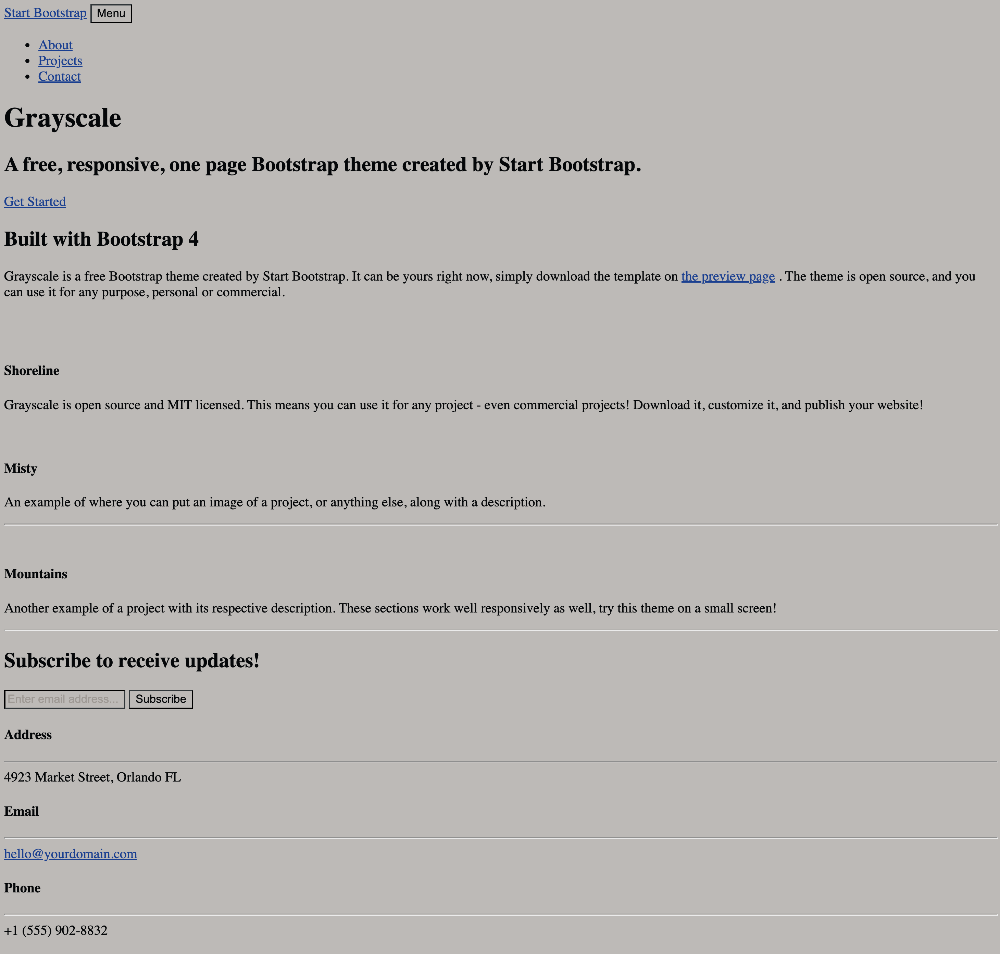
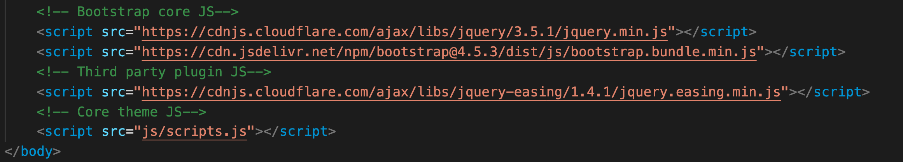
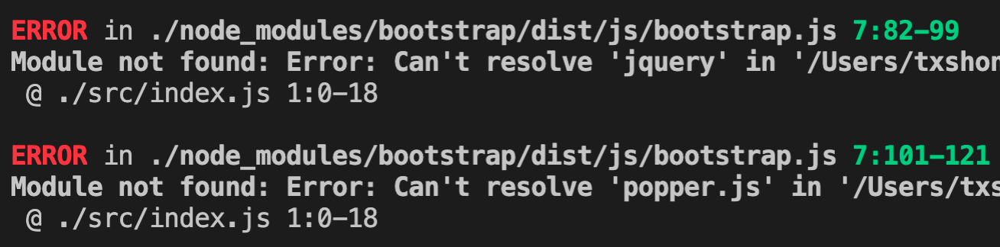
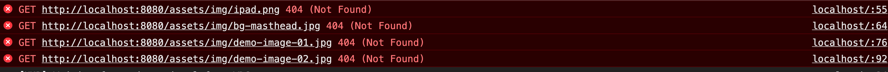

# 前言

我們現在已經學會了如何使用以下技能
* npm 安裝需要的插件
* webpack 打包我們的 Javascript
* webpack plugin 安裝使用好用的打包工具插件
* webpack with ES6 將打包工具把 ES6 的程式打包成 ES5 讓瀏覽器可以看的懂
* webpack 載入 js, css 跟圖檔

但是我們是不是還需要一些技能來讓你的專案模組化呢？


# 資料夾結構
你可以將 17-3 的資料夾複製一份並修改

    MyProject
    |- dist
    |- src
        |- index.js
        |- index.html
        |- styles.css
    |- package.json
    |- webpack.config.js

# 我們要學的是
* 如何讓你的 webpack 可以載入 html
* 如何讓頁面跑起來
* 如何讓 HTML 可以 Hot Reload

## 如何讓你的 webpack 可以載入 html
首先，我們要為我們的專案安裝 html-webpack-plugin，這樣我們才可以載入資料夾內的 html
### 使用 yarn 安裝
    yarn add html-webpack-plugin
### 或是使用 npm 安裝
    npm install --save-dev html-webpack-plugin

再來，我們要在 webpack config 內設定為
```javascript
// webpack.config.js
var path = require('path')
var HtmlWebpackPlugin = require('html-webpack-plugin')

module.exports = {
    entry: ['./src/index'],
    output: {
        path: path.join(__dirname, 'dist'),
        filename: 'bundle.js'
    },
    plugins: [
        new HtmlWebpackPlugin({
            template: './src/index.html'
        })
    ],
    module: {
        loaders: [{
            test: /\.css$/,
            loaders: ['style', 'css']
        }]
    }
}
```

### 載入 styles.css
因為加上這個插件後， html 與 js 可以成功的被 webpack 讀取，但是 styles.css 內的 style 並沒有畫到 html 內。所以，我們要在 index.js 內，將 styles.css 引入進來
```js
// src/index.js
import './styles.css'
```
## 如何讓頁面跑起來
我們要讓我們的頁面跑起來，如果以我們在 html 課堂中學到的，我們是跑到 VS Code 的 html 上按住右鍵-[start a liveserver]，使用 live-server 來幫助我們跑我們需要的頁面。
但這樣有幾個問題:

* 打開的頁面只有單頁
* 打開的頁面沒有 css
* 打開的頁面沒有 js

當然，你可以在 html 內嵌入 css, js，但在成為更好的前端工程師的目標下，我們來學學如何把他們切出來，並用程式很好的掛載。

### 開發伺服器 ( Dev Server )
我們前面看到的 live-server 本身就是一個簡單的伺服器，並且具有 Hot Reloading ( 隨存隨現 )。每當你一存檔，html 的內容便跑在  localhost:8000 上，對於開發來說十分的方便。
為了更好的管理，我們這邊要用 webpack 內建的 server 來開發!
1. 安裝 Webpack Dev Server
   
    為了方便我們將 dev-server 同時在本專案與全域安裝

    #### Yarn 安裝 webpack-dev-server
    ```bash
        yarn global add webpack-dev-server
        yarn add webpack-dev-server
    ```
    #### Npm 安裝 webpack-dev-server
    ```bash
        npm install -g webpack-dev-server
        npm install --save-dev webpack-dev-server
    ```

2. 將 webpack 設定劃分為 dev 和 prod
    當我們開發的時候常常分為開發 ( development ) 與打包產出 ( build production ) 兩個階段，我們可以簡稱為 dev 與 prod。 因為兩種環境的不同，我們的設定環境也會不同，所以我們要把我們原先的 webpack.config.js 一拆為二，如此在對的環境有對的設定。
    
    webpack.config.js

    -> webpack.config.dev.js
    
    -> webpack.config.prod.js

    #### webpack.config.dev.js
    首先我們要多引入 webpack 套件
    - 在 entry 中我們要加入兩加入行來載入 dev-server
    - 在 plugin 新增 new webpack.HotModuleReplacementPlugin()
    - 新增 devServer
      - contentBase: 服務的檔案來自的地方，這裡我們引入 webpack 編譯過的輸出資料夾，簡稱 distro 的 './dist'
      - hot: 開啟 HMR ( Hot Module Replacement ) 的功能

    ```js
    // webpack.config.dev.js
    var path = require('path')
    var webpack = require('webpack')
    var HtmlWebpackPlugin = require('html-webpack-plugin')

    module.exports = {
        entry: [
            'webpack-dev-server/client?http://localhost:8080',
            'webpack/hot/dev-server',
            './src/index'
        ],
        output: {
            path: path.join(__dirname, 'dist'),
            filename: 'bundle.js'
        },
        plugins: [
            new webpack.HotModuleReplacementPlugin(),
            new HtmlWebpackPlugin({
                template: './src/index.html'
            })
        ],
        module: {
            loaders: [{
                test: /\.css$/,
                loaders: ['style', 'css']
            }]
        },
        devServer: {
            contentBase: './dist',
            hot: true
        }
    }
    ```
    #### webpack.config.prod.js
    prod 因為只要打包，則不需要開啟 dev-server 的功能
    ```js
    // webpack.config.prod.js
    var path = require('path')
    var HtmlWebpackPlugin = require('html-webpack-plugin')

    module.exports = {
        entry: ['./src/index'],
        output: {
            path: path.join(__dirname, 'dist'),
            filename: 'bundle.js'
        },
        plugins: [
            new HtmlWebpackPlugin({
                template: './src/index.html'
            })
        ],
        module: {
            loaders: [{
                test: /\.css$/,
                loaders: ['style', 'css']
            }]
        }
    }
    ```


3. 如何跑起來
   
   我們要開發( dev )，我們可以在指令列打下:
   ```bash
   webpack serve --mode development --env development
   ```
   我們要打包產出( build production )時，我們可以在指令列打下:
   ```bash
   webpack --config webpack.config.prod.js
   ```

   為了更方便未來的使用與跟伙伴們一同開發，我們可以將我們的指令，加入到 package.json 的設定檔:
    ```json
    // package.json
    {
    //...
    "scripts": {
        "dev"  : "webpack serve --mode development --env development",
        "build": "webpack --config webpack.config.prod.js"
    }
    //...
    }
    ```
    以後我們要開發，我們可以使用此 npm 指令:
    ```bash
    npm run dev
    ```
    以後我們要打包產出，我們可以使用此 npm 指令:
    ```bash
    npm run build
    ```
    現在，你可以透過 npm run dev 來開發你的專案了！並在 http://localhost:8080 看到你的網站

## 如何讓 HTML 可以 Hot Reload
當我們執行以上的設定後，我們發現當我們改動 index.html 的時候，我們的指令列的程式會跟著跑，但是，我們的瀏覽器 localhost:8080 頁面內的內容卻沒有改變。沒關係！我們要使用 raw-loader 在開發環境內動態載入我們 index.html

1. 安裝 raw-loader
    ### 使用 Yarn 安裝 raw-loader
    ```bash
    yarn add raw-loader
    ```
    ### 使用 Npm 安裝 raw-loader
    ```bash
    npm install --save-dev raw-loader
    ```

2. 加入 webpack dev config
    在 module 內加入 raw-loader
    ```js
    // webpack.config.dev.js
    const path = require("path")
    var webpack = require('webpack')
    var HtmlWebpackPlugin = require('html-webpack-plugin')

    module.exports = {
        mode: "development",
        entry: [
            'webpack-dev-server/client?http://localhost:8080',
            'webpack/hot/dev-server',
            "./src/index"
        ],
        output: {
            filename: "bundle.js",
            path: path.resolve(__dirname, "dist")
        },
        plugins: [
            new webpack.HotModuleReplacementPlugin(),
            new HtmlWebpackPlugin({
                template: './src/index.html'
            })
        ],
        module: {
            rules: [
                {
                    test: /\.m？js$/, // js 檔案的RegExp
                    exclude: /(node_modules)/,
                    use: {
                        loader: "babel-loader",
                        options: {
                            presets: ['@babel/preset-env']
                        }
                    }
                },
                {
                    test: /\.css$/, // css 檔案的RegExp
                    use: [
                        "style-loader",
                        "css-loader"
                    ]
                },
                {
                    test: /\.html$/, // css 檔案的RegExp
                    use: [
                        "raw-loader",
                    ]
                },
                {
                    test: /\.(png|svg|jpg|gif)$/, // 圖片檔案的RegExp
                    use: [
                        "file-loader"
                    ]
                }
            ]
        },
        devServer: {
            contentBase: './dist',
            hot: true
        }
    };
    ```
    3. index.js 加入程式碼

        因為 index.js 在 development 與 production 兩種環境下都會執行，我們必須要設定一個條件式來確保我們的 index.js 內的程式只在開發階段被執行。我們使用的方法為 process 環境的參數
        ```js
        process.env.NODE_ENV
        ```
        我們希望他在不是 production 的情況下跑
        ```js
        process.env.NODE_ENV !== 'production'
        ```
        最終，我們在 index.js 加入這段程式
        ```js
        // src/index.js
        if (process.env.NODE_ENV !== 'production') {
           require('./index.html')
        }
        ```


# 本次作業要做的是
希望同學可以用 npm, webpack 來管理你的專案，我希望同學可以試著用 npm 安裝  bootstrap, google-fonts, jquery 甚至是 font-awesome 圖標庫。
再來，你便可以將你的專案上傳到 Github 與大家分享啦！

我會按你的星星鼓勵你的！

## Bootstrap

#### Yarn 安裝 Bootstrap
```bash
yarn add bootstrap
```
#### Yarn 安裝 Bootstrap
```bash
npm install bootstrap --save
```
這個範例是使用 StartBootstrap 的免費 Theme [Grayscale](https://startbootstrap.com/theme/grayscale)

因為我們只有要 Theme 的內容，所以我們只把 head 內的 title 複製到 index.html ，Theme 內的 body 中 section 與 footer 複製到 index.html。對於 head 內的 css 等套件與 body 後的 javascript 我們都不引入，因為這些東西我們要用 npm package 來做好管理與版本控制。

當我們灌好 Boostrap 後，打開眼簾的是一片慘不忍睹，是沒有 style 的 html 與 div 。接下來，我們要一步一步引入需要的元件。



### Bootstrap JS 

當我們要把 Bootstrap 在我們的專案中跑起來的時候，有很重要的一部份就是 Bootstrap Javascript 的部分。
以往我們使用 Boostrap 的方式是在 style 放在 head 讓 css 先載，再來載入html，讓使用者不會看到醜醜的 html，因為 css style 先載好。最後，才在 body 尾巴的部分載入 jQuery, Boostrap 與自己的客製 javascript 讓頁面動起來。


不過，我們前面學到的已經可以在 index.html 內寫 html, styles.css 寫 css, index.js 載 javascript。現在，我們在 index.js 內載入 Boostrap 。
```js
// src/index.js
import 'bootstrap'
```

這個時候，我們去跑 npm run dev。結果指令列壞掉了！


我們需要一起連同 jQuery 與 popper.js 都裝到本專案內

#### Yarn 安裝 jQuery 與 popper.js
```bash
yarn add jquery popper.js
```
#### Npm 安裝 jQuery 與 popper.js
```bash
npm install jquery popper.js --save
```

### Webpack 如何使用 jQuery
在安裝 Boostrap 的過程中，我們一同也將 jQuery 也裝好了!

不過我們應該要如何在 webpack 中使用呢？

我們可以把 jQuery 當作 webpack plugin 來用
我們將 $, jQuery 等關鍵字都指定給我們 npm 的 jquery package 來用
```js
//webpack.config.dev.js
plugins: [
    new webpack.HotModuleReplacementPlugin(),
    new HtmlWebpackPlugin({
        template: './src/index.html'
    }),
    new webpack.ProvidePlugin({
        $: "jquery",
        jQuery: "jquery"
    })
],
```


### Bootstrap CSS 
   我們已經在我們之前 17章 教導過 style-loader, css-loader。要確保他有在你的 webpack config 內喔！
   ```js
   //webpack.config.dev.js
   {
        rules: [
            {
            test: /\.css$/,
            use: ['style-loader', 'css-loader']
            }
        ]
    }
   ```
   再來，我們只要在 index.js 內 import boostrap distro 內的壓縮版 css min.css
   ```js
   // index.js
   import 'bootstrap/dist/css/bootstrap.min.css';
   ```

## Google Fonts
這次的 theme 中在 head 引入了 google fonts，但現在我們要換個語法直接在 styles.css 引入

我們將原本 head 的 \<link href="..." rel="stylesheet" />

換成了 css 的 @import url(...) 語法


我們在 styles.css 中新增
```css
/* src/styles.css */
@import url("https://fonts.googleapis.com/css?family=Varela+Round");
@import url("https://fonts.googleapis.com/css?family=Nunito:200,200i,300,300i,400,400i,600,600i,700,700i,800,800i,900,900i");
```

## FontAwesome 圖標集
在很多的專案中我們都會用到 font-awesome，而本專案的也有使用到 font-awesome
現在讓我們用 npm 來裝他吧！

#### Yarn 安裝 fontawesome-free
```bash
yarn add @fortawesome/fontawesome-free
```
#### Npm 安裝 fontawesome-free
```bash
npm install --save-dev @fortawesome/fontawesome-free
```

然後在我們的 index.js 引入這些圖標
```js
// src/index.js
import '@fortawesome/fontawesome-free/js/fontawesome'
import '@fortawesome/fontawesome-free/js/solid'
import '@fortawesome/fontawesome-free/js/regular'
import '@fortawesome/fontawesome-free/js/brands'
```


## 將 theme 內的 Assests 移入
記得也要把 theme 的 assests 資料夾移到專案 src 資料夾喔！
## 讓 index.html 中的圖找的到 assets/img
當我們執行 npm run dev 時，我們在 localhost:8080 的頁面中，看不到 template 的圖片。這是因為 localhost:8080/assets... 是沒有東西的!
assets 也必須要打包到 dist 才行。



### copy-webpack-plugin

這時候，我們要使用 copy-webpack-plugin
#### Yarn 安裝 Copy Webpack Plugin
```bash
yarn add copy-webpack-plugin
```
#### Npm 安裝 Copy Webpack Plugin
```bash
npm install copy-webpack-plugin --save-dev
```

安裝完後，我們要將 src/assets 搬到 assets 來讓 html 可以找的到圖，我們在 webpack config 使用本 plugin

```js
//webpack.config.dev.js
const CopyWebpackPlugin = require("copy-webpack-plugin");
...
plugins: [
    new webpack.HotModuleReplacementPlugin(),
    new HtmlWebpackPlugin({
        template: './src/index.html'
    }),
    new webpack.ProvidePlugin({
        $: "jquery",
        jQuery: "jquery"
    }),
    new CopyWebpackPlugin({
        patterns: [
            { from: 'src/assets', to: 'assets' }
        ]
    })
],
...
```

## 將 theme 內的 css/styles.css 移入 src/styles.css
理論上，你能夠將 theme 內的 styles.css 內的全選，複製到 src/styles.css 空白的 css 並貼上。但有一點必須要注意，因為 grayscale 原本的 assets 是跟 css 資料夾同一層，而原本的 styles.css 是在名為 css 資料夾內的檔案。theme 內 css/styles.css 在引入 assets 的時候，是使用 ../assets/.... 的語法。而在本專案，assets 則是與 styles.css 同一層，應將本專案複製後的 src/styles.css 的 ../assets 改為 ./assets
## 將 theme 內的 JS 移入
首先有兩塊 javascript 我們還沒移入
1. body 尾巴的 jquery easing
   
    ### jquery.easing
    我們需要安裝 jQuery Easing 這個套件
    #### Yarn 安裝 Copy Webpack Plugin
    ```bash
    yarn add jquery.easing
    ```
    #### Npm 安裝 Copy Webpack Plugin
    ```bash
    npm install jquery.easing --save-dev
    ```

    來使用他，我們只需要在 index.js 內 import 這個套件即可
    ```js
    //src/index.js
    import 'jquery.easing'
    ```
2. body 尾巴的 js 資料夾內的 scripts.js

    將 theme 內的 js 資料夾直接拉到專案 src 內，
    我們在 index.js 直接 import
    ```js
    //src/index.js
    import './js/scripts'
    ```
